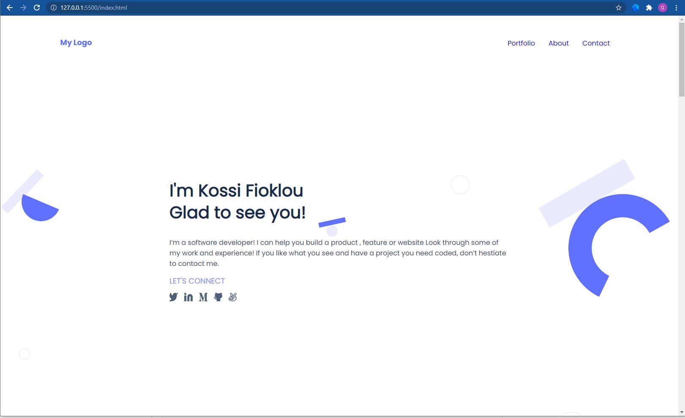

# Mobile_Version_Skeleton

> This project is to create a mobile version skeleton using Figma template.

This project is to create a mobile version skeleton using Figma template
It is a web page that contains three sections in the first section we have a header, the main page, the second section contains works page, about page, and the last section contains a contact form and CSS to style it. I added index.html file and style.css file, test.md file, and test.md file to .gitignore file.

## Live Demo

[Live Demo Link](https://raw.githack.com/Kossi-stack/Mobile_Version_Skeleton/github-deployment/index.html)

## Built With

- Html
- Css

##  Prerequisites

- Text editor
- Git
- Html
- Css

## Getting Started

To get a local copy up and running follow these simple example steps.

- You can clone this repo by typing git clone `https://github.com/Kossi-stack/Mobile_Version_Skeleton.git` on your terminal
- Type cd `Mobile_Version_Skeleton` to access the project on the terminal

## Author

👤 **Kossi-Stack**

- GitHub: [@githubhandle](https://github.com/Kossi-stack/Mobile_Version_Skeleton)
- LinkedIn: [LinkedIn](https://www.linkedin.com/in/kossifioklou2406/)

## 🤝 Contributing

Contributions, issues, and feature requests are welcome!

Feel free to check the [issues page](https://github.com/Kossi-stack/Mobile_Version_Skeleton/issues).

## Show your support

Give a ⭐️ if you like this project!

## 📝 License

This project is [MIT](./MIT.md) licensed.
